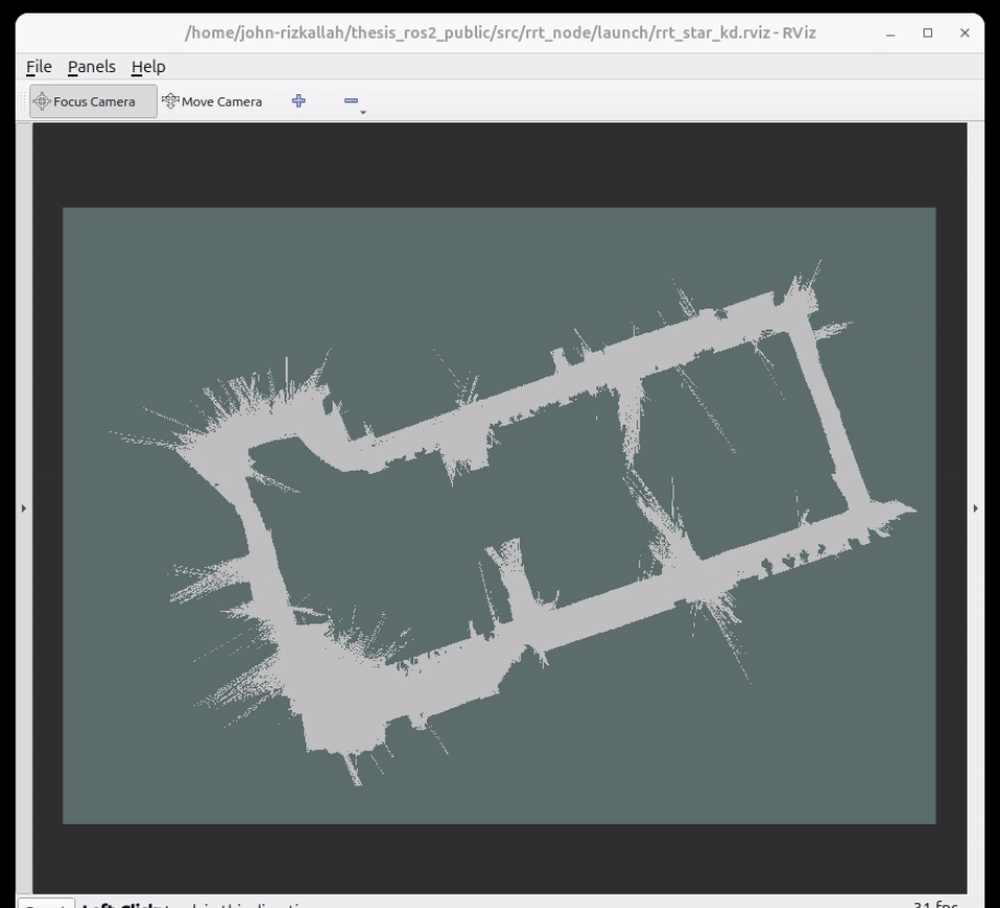

# ROS 2 Autonomous Delivery Path Planning

ROS 2 modernization of the navigation components from my master's thesis:
**Integrated Autonomous Delivery System: Enhancing Vehicle-to-User Interaction and Dynamic Path Planning**.

## Current milestone

A standalone C++ implementation of **RRT*KD** that:

- Loads an occupancy-grid map from YAML and PGM files
- Uses OpenCV for map processing
- Uses FLANN KD-tree nearest-neighbor and radius searches
- Performs collision checking with a conservative vehicle footprint
- Produces a collision-free path in world coordinates
- Exports planning output as a text path and JSON data file

## Demo

The visualization shows occupancy-grid navigation, the dark-blue RRT*KD exploration tree, and the final optimized route in green.



## Quick demo

Build the workspace:

```bash
source /opt/ros/jazzy/setup.bash
colcon build
source install/setup.bash
```

Launch the planner with RViz:

```bash
ros2 launch rrt_node rrt_star_kd_demo.launch.py
```

In RViz:
1. Set **Fixed Frame** to `map`
2. Click **Add** → By topic → `/rrt_star_kd/path` → Path
3. Click **Add** → By topic → `/rrt_star_kd/markers` → Marker
4. Press **Z** to zoom out to fit the view

Call the planning service:

```bash
ros2 service call /rrt_star_kd/plan std_srvs/srv/Trigger {}
```

The RRT*KD planner will compute a path and publish it to RViz with start (green) and goal (red) markers.

## Thesis context

The original system combined:

- Occupancy-grid mapping
- RRT*KD global path planning
- Model Predictive Control trajectory tracking
- QR-based vehicle-to-user interaction
- Finite-state behavioral planning

## Status

Work in progress: converting the standalone RRT*KD implementation into a ROS 2 node that will publish `nav_msgs/Path` for RViz visualization.
